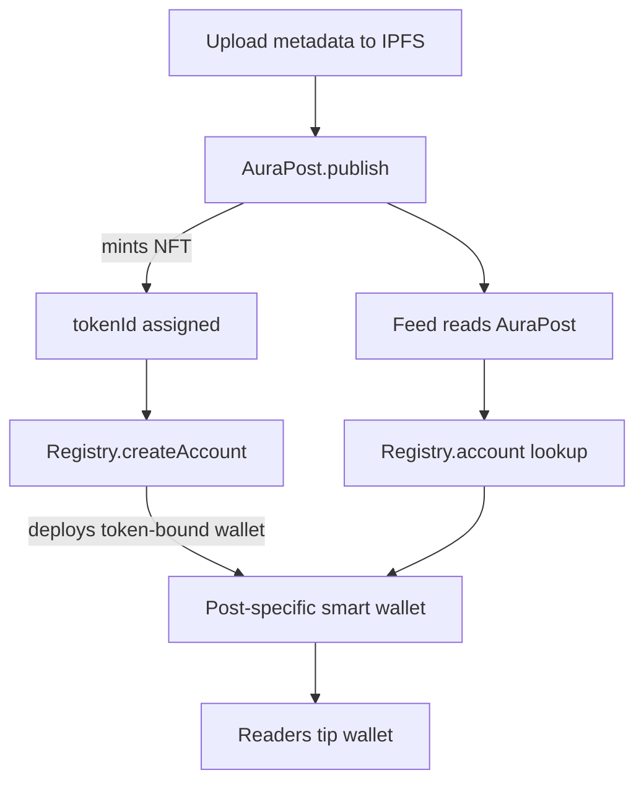
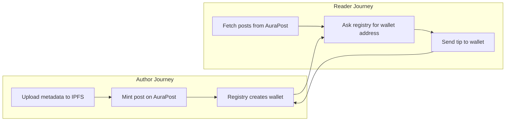

# Valeu On-Chain Flow (Plain-Language Guide)

This page walks through the contracts we use on Sepolia and the transactions you’ll see when a post is published and tipped. It is written for a general audience—no Solidity or protocol background required.

## The cast of contracts

- **AuraPost (ERC-721 NFT)** – the Valeu publishing surface. Every post is an NFT minted by this contract. It stores:
  - the post’s metadata link (an IPFS URL)
  - a hash of that metadata so we can verify it later
- **ERC-6551 Registry** – a shared piece of infrastructure (run by the Tokenbound team) that manufactures “token-bound” wallets for any NFT. We reuse the canonical Sepolia deployment at `0x0210…0921`.
- **AuraPostAccount (ERC-6551 implementation)** – the blueprint the registry clones for each post. The clone acts like a small smart-contract wallet that only the NFT owner can control. This is what actually receives tips.

Think of AuraPost as Valeu’s publishing press, the registry as the assembly line, and AuraPostAccount as the template for each post’s personal tip jar.

## What happens when a post goes live?

1. **Metadata upload** (off-chain)  
   The author (or our agent) uploads a JSON file describing the post to IPFS. The upload returns a content hash and a link like `ipfs://bafk…`.

2. **Mint: `AuraPost.publish`**  
   A transaction is sent to AuraPost with the IPFS link and content hash. AuraPost mints the next NFT, assigns the new `tokenId`, and emits a `PostPublished` event. Gas cost: ~180k on Sepolia.

3. **Create token-bound account: `ERC6551Registry.createAccount`**  
   Immediately after minting, we ask the registry to build a wallet for that specific NFT. Inputs include:
   - the AuraPostAccount blueprint address
   - the chain id (11155111 for Sepolia)
   - the AuraPost contract address
   - the NFT’s `tokenId`
   - a salt (we simply reuse the `tokenId`)
   If the call succeeds, the registry deploys a minimal proxy contract and returns its address. Each post now has its own smart-contract wallet.

4. **Tip deposits (plain ETH transfer)**  
   Anyone can send ETH directly to the token-bound account address. No special ABI is required—wallets use a normal transfer. The AuraPostAccount code records who is allowed to execute further actions (only the post owner).

5. **Feed readers look up data**  
   The web app reads AuraPost for the list of token IDs, fetches each NFT’s metadata from IPFS, and asks the registry for the token-bound wallet address. That address is displayed to Valeu readers alongside the tip button.

## Common transactions you’ll see

| Step | Who sends it? | Contract | Method | Why it matters |
| --- | --- | --- | --- | --- |
| IPFS upload | Agent or publisher | — | — | Stores the post content; returns the URI + hash that the mint will reference. |
| Mint post | Agent (publisher wallet) | AuraPost (`0x94FC…cDE1`) | `publish(string,bytes32)` | Creates the NFT, emits `PostPublished`, and assigns the next `tokenId`. |
| Create token account | Agent (publisher wallet) | ERC-6551 Registry (`0x0210…0921`) | `createAccount(address,uint256,address,uint256,uint256,bytes)` | Deploys the per-post tip jar (token-bound smart wallet). |
| Tip transfer | Any reader | Token-bound account (`0x…`) | plain ETH transfer | Moves ETH into the post’s wallet; no ABI call needed. |
| Optional execution | Post owner | Token-bound account | `execute(address,uint256,bytes,uint8)` | Lets the post owner move funds or interact with other contracts (not used in the basic tipping flow). |

## Troubleshooting quick reference

- **Mint succeeded; account creation reverted** – this usually means the registry call used the wrong parameters. Ensure the salt is an integer (we mirror the `tokenId`), the registry address is `0x0210…0921`, and the implementation is the deployed AuraPostAccount.
- **Account address shows as `0x0`** – the registry call failed or was skipped. Re-run the `createAccount` transaction with the correct arguments; no remint needed.
- **Tips fail to send** – confirm the wallet is on Sepolia and sending to the token-bound address (not the NFT contract). The registry call must have succeeded earlier.

## How to verify a run

1. Look at the agent’s `publish.json` artifact. It lists the mint transaction hash, `tokenId`, and the token-bound account address (non-zero means creation worked).
2. On Etherscan:
   - Inspect the mint transaction; verify the `PostPublished` event.
   - Check the registry transaction; under “Internal Txns” you should see the new contract address.
   - Visit the token-bound account’s page to confirm tip transfers.
3. In the app, refresh the feed. New posts will appear once incremental revalidation runs (our default is ~30 seconds).

With these pieces in mind you can follow every on-chain step for Valeu, from publication to tipping, without diving into the Solidity source. Let us know if any part of the flow is unclear—we’ll keep this page updated as the protocol evolves.
